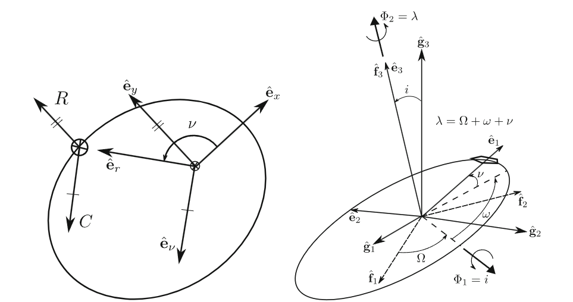

# Unified State Model
The Unified State Model (USM) is an alternative approach to modeling and propagating satellite orbits. It was developed to address the limitations of traditional Cartesian coordinates and Keplerian elements. USM combines quaternion-based rotational models and hodograph-based velocity models, offering increased numerical stability and improved computational efficiency, especially for complex or perturbed orbits. There are multiple variant of the USM. Beyond the quaternion based approach there is also a Modified Rodriguez Parameters appoach and an exponential mapping approach.

*Image of USM Orbital Elements [1]*

## USM7 Components
Unified State Model Orbital Elements. 7D parameterziation of the orbit using Velocity Hodograph and Quaternions
* **Velocity Hodograph**
    * Velocity Hodograph Normal Component (C): Normal Component of Velocity Hodograph to the Radial Vector Laying in the Orbital Plane
    * First Velocity Hodograph In-Plane Component (Rf1): Hodograph 90 degrees ahead of the Eccentricity Vector Along the Intermediate Rotating Frame X-Axis
    * Second Velocity Hodograph In-Plane Component (Rf2): Hodograph 90 degrees ahead of the Eccentricity Vector Along the Intermediate Rotating Frame Y-Axis
* **Quaternions**
    * First Imaginary Quaternion Component (ϵO1): First Component of Euler Vector
    * Second Imaginary Quaternion Component (ϵO2): Second Component of Euler Vector
    * Third Imaginary Quaternion Component (ϵO3): Third Component of Euler Vector
    * Real Quaternion Component (η0): Scalar Component of Quaternion Rotation

## USM6 Components

Unified State Model Orbital Elements. 6D parameterziation of the orbit using Velocity Hodograph and MRP's
* **Velocity Hodograph**
    * Velocity Hodograph Normal Component (C): Normal Component of Velocity Hodograph to the Radial Vector Laying in the Orbital Plane
    * First Velocity Hodograph In-Plane Component (Rf1): Hodograph 90 degrees ahead of the Eccentricity Vector Along the Intermediate Rotating Frame X-Axis
    * Second Velocity Hodograph In-Plane Component (Rf2): Hodograph 90 degrees ahead of the Eccentricity Vector Along the Intermediate Rotating Frame Y-Axis
* **Modified Rodriguez Parameters**
    * First Modified Rodriguez Parameter (σ1)
    * Second Modified Rodriguez Parameter (σ2)
    * Third Modified Rodriguez Parameter (σ3)

## USMEM Components

Unified State Model Orbital Elements. 6D parameterziation of the orbit using Velocity Hodograph and Exponential Mapping
* **Velocity Hodograph**
    * Velocity Hodograph Normal Component (C): Normal Component of Velocity Hodograph to the Radial Vector Laying in the Orbital Plane
    * First Velocity Hodograph In-Plane Component (Rf1): Hodograph 90 degrees ahead of the Eccentricity Vector Along the Intermediate Rotating Frame X-Axis
    * Second Velocity Hodograph In-Plane Component (Rf2): Hodograph 90 degrees ahead of the Eccentricity Vector Along the Intermediate Rotating Frame Y-Axis
* **Quaternions**
    * First Exponential Mapping Component (a1)
    * Second Exponential Mapping Component (a2)
    * Third Exponential Mapping Component (a3)

## References
[1]: https://link.springer.com/article/10.1007/s10569-011-9396-5#:~:text=The%20Unified%20State%20Model%20is,a%20set%20of%20seven%20elements.
[2]: Van den Broeck, Michael. "An Approach to Generalizing Taylor Series Integration for Low-Thrust Trajectories." (2017). 
[3]: https://link.springer.com/article/10.1007/BF01227757